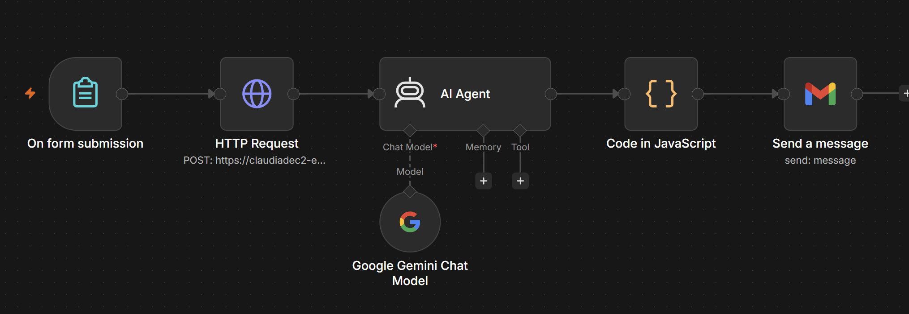

# AI Sales Report Automation

Automatically turns a messy e-commerce CSV into a cleaned dataset, key business metrics, and an AI-written action plan — then emails an HTML dashboard to stakeholders.

> Built with n8n · Hugging Face Spaces · Python · Google Gemini · Gmail

---

## Demo

📹 [Watch the 25-second walkthrough](https://drive.google.com/file/d/1XNKpLm3cyjeFWT4o9KSlHb4geAxdeMmM/view?usp=sharing) — CSV upload → cleaned data → email dashboard delivered.

---

## How It Works

| Step | What happens |
|------|--------------|
| 1. Upload | Business user submits a messy CSV via n8n Form Trigger |
| 2. Clean | n8n sends the file to a Python API on Hugging Face Spaces — trims whitespace, handles nulls, isolates corrupted rows, tracks cancelled/returned revenue |
| 3. Insights | Google Gemini turns the metrics into a 3-sentence business action plan (plain English, no jargon) |
| 4. Email | A JavaScript node builds an HTML scorecard; Gmail node sends it to the stakeholder |

---

## n8n Workflow Structure

| Node | Role |
|------|------|
| Form Trigger | Receives the uploaded CSV from the business user |
| HTTP Request | POSTs file to Hugging Face API → returns cleaned metrics JSON |
| AI Agent (Gemini) | Generates a 3-sentence consultant-style recommendation |
| Code (JavaScript) | Builds the HTML email: KPI cards + AI insight + top products table |
| Gmail | Sends the final HTML report to the stakeholder |

---

## Key Business Outputs

- **Financial snapshot** — gross revenue, average order value (AOV), total transactions
- **Leakage tracker** — revenue lost to cancelled or returned orders
- **Top 3 product lines** — ranked by revenue from the uploaded CSV
- **Plain-English insights** — consultant-tone copy, no technical jargon

---

## Files in This Repo

| File | Description |
|------|-------------|
| `app.py` | Hugging Face Space backend — CSV cleaning and metric generation |
| `n8n_workflow.json` | Exportable n8n workflow (import directly into any n8n instance) |
| `workflow-stru.png` | Visual map of the n8n node sequence |
| `demo.mp4` | 45-second walkthrough of the full pipeline |
| `requirements.txt` | Python dependencies for the Space |
| `Dockerfile` | Container config used by Hugging Face |

---

## Quick Start

1. Import `n8n_workflow.json` into your n8n instance.
2. Add credentials: Hugging Face API URL, Gmail, Google Gemini API key.
3. Open the Form Trigger URL and upload a messy sales CSV.
4. Check your inbox for the HTML dashboard email.

---

## Live API

The cleaning backend is hosted on Hugging Face Spaces:
`https://claudiadec2-eda-cleaner-api.hf.space/analyze`
